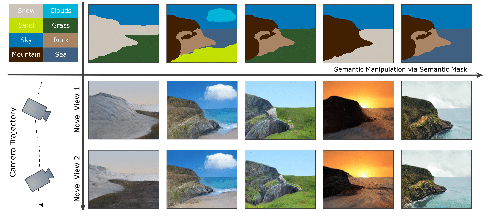

# Painting 3D Nature in 2D: View Synthesis of Natural Scenes from a Single Semantic Mask


### [Project Page](https://zju3dv.github.io/paintingnature) | [Video](https://youtu.be/-ipSXuzSs2A) | [Paper](https://openaccess.thecvf.com/content/CVPR2023/papers/Zhang_Painting_3D_Nature_in_2D_View_Synthesis_of_Natural_Scenes_CVPR_2023_paper.pdf) 


> [Painting 3D Nature in 2D: View Synthesis of Natural Scenes From a Single Semantic Mask](https://openaccess.thecvf.com/content/CVPR2023/html/Zhang_Painting_3D_Nature_in_2D_View_Synthesis_of_Natural_Scenes_CVPR_2023_paper.html)  
> Shangzhan Zhang, Sida Peng, Tianrun Chen, Linzhan Mou, Haotong Lin, Kaicheng Yu, Yiyi Liao, Xiaowei Zhou\
> CVPR 2023

## Installation

### Set up the python environment

```
conda create -n paintnature
conda activate paintnature
pip install -r requirements.txt
```

Install [PyTorch3D](https://github.com/facebookresearch/pytorch3d/blob/main/INSTALL.md).
```
import sys
import torch
pyt_version_str=torch.__version__.split("+")[0].replace(".", "")
version_str="".join([
    f"py3{sys.version_info.minor}_cu",
    torch.version.cuda.replace(".",""),
    f"_pyt{pyt_version_str}"
])
!pip install fvcore iopath
!pip install --no-index --no-cache-dir pytorch3d -f https://dl.fbaipublicfiles.com/pytorch3d/packaging/wheels/{version_str}/download.html
```

Install [Imaginaire](https://github.com/NVlabs/imaginaire).
```
export CUDA_VERSION=$(nvcc --version| grep -Po "(\d+\.)+\d+" | head -1)
CURRENT=$(pwd)
for p in correlation channelnorm resample2d bias_act upfirdn2d; do
    cd imaginaire/third_party/${p};
    rm -rf build dist *info;
    python setup.py install;
    cd ${CURRENT};
done
```

### Set up datasets

#### 1. Pre-trained model

Download the pretrained model from [this link](https://drive.google.com/file/d/1xvnwgIoSoPMOEz6V-CN1ZOfE3JiZ1UgE/view?usp=sharing).

The pretrained model should be placed in `./ckpts` folder.

#### 2. Our processed data

Download the processed data from [this link](https://drive.google.com/file/d/18yKN7eT13G3vGaO0Xo7spZrQLUUrjpzA/view?usp=sharing).

The processed data should be placed in `./datasets` folder.

#### 3. Download SPADE model

Download the SPADE model from [this link](https://drive.google.com/u/0/uc?id=1NIh3_UZ6uqvzS4mJ4JVhfyYQuG9ZMmvA&export=download).

Rename the model to `lhq-1NIh3_UZ6uqvzS4mJ4JVhfyYQuG9ZMmvA.pt` and place it in `./checkpoints` folder.

### Visualization

```
sh configs/render.sh 182 18 0.1
```

### Training a model
```
TODO
```

## Citation

If you find this code useful for your research, please use the following BibTeX entry.

```
@inproceedings{Zhang2023Painting3N,
  title={Painting 3D Nature in 2D: View Synthesis of Natural Scenes from a Single Semantic Mask},
  author={Shangzhan Zhang and Sida Peng and Tianrun Chen and Linzhan Mou and Haotong Lin and Kaicheng Yu and Yiyi Liao and Xiaowei Zhou},
  booktitle={CVPR},
  year={2023}
}
```

## Acknowledgement

Some of the code in this repo is borrowed from [SinNeRF](https://github.com/VITA-Group/SinNeRF), [AdaMPI](https://github.com/yxuhan/AdaMPI), [GANcraft](https://github.com/NVlabs/imaginaire), [3DP](https://github.com/vt-vl-lab/3d-photo-inpainting). We thank the authors for their great work!